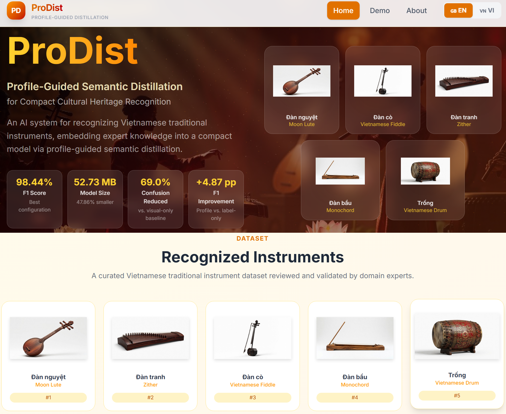

# ProDist: Profile-Guided Semantic Distillation for Compact Cultural Heritage Recognition

This repository provides the data, framework source code, and web-platform source code for **ProDist**, a profile-guided semantic distillation framework for compact cultural heritage recognition in expert systems.

ProDist uses expert-reviewed class profiles as training-time semantic guidance for compact image-only recognition. During training, the student model learns from visual teacher supervision and class-level semantic profile guidance. During deployment, only the image-based student classifier is retained.

## Web Platform Preview

<p align="center">
  
</p>

<p align="center">
  <em>Deployment-oriented ProDist web interface for image-only Vietnamese traditional-instrument recognition.</em>
</p>

## Highlights

- **Training-time expert knowledge, image-only deployment.** ProDist uses expert-reviewed class profiles only during training. The deployed model remains a compact image-only classifier, which makes it practical for web-based and expert-system deployment.

- **Profile-guided semantic distillation.** Each instrument class is described by a fixed six-field profile covering name, visible form, material or construction cues, playing technique, use, and cultural context. These profiles are encoded as fixed semantic prototypes and used to guide student representation learning.

- **Beyond ordinary visual distillation.** Conventional knowledge distillation transfers teacher behavior through logits or visual relations. ProDist adds profile-based semantic alignment and separation, so the student learns not only visual discrimination but also distinctions encoded in expert-reviewed cultural profiles.

- **Strong held-out recognition performance.** The best ProDist configuration achieves **98.44% F1 Score** on the held-out test set. It improves over the strongest visual-only baseline by **4.05 percentage points** and over the strongest non-ProDist multi-teacher KD baseline by **0.81 percentage points**.

- **Clear matched-setting gain.** Under the matched DN121+IncV3 → DN121-S configuration, adding profile-guided semantic supervision raises the F1 Score from **97.34%** for MT-KD to **98.44%** for ProDist. The teacher set, deployed student, and inference path are kept fixed.

- **Meaningful profile content matters.** Controlled ablations show that full expert-reviewed profiles outperform class-name-only profiles, while shuffled profiles and random prototypes reduce performance. This supports the claim that the gain comes from meaningful class-profile supervision rather than from an arbitrary auxiliary target.

- **Reduced ambiguity-driven errors.** ProDist reduces macro-averaged pairwise confusion among visually similar but profile-distinct instrument classes by **69.0%** relative to the visual-only baseline and by **47.5%** relative to matched MT-KD.

- **Compact deployed student.** The best ProDist student, DN121-S, reaches **98.44% F1 Score** with a **52.73 MB** classification-only checkpoint. This checkpoint is **47.86% smaller** than the strongest visual-only DN201 checkpoint under the same size-audit protocol.

- **Expert-system relevance.** The predicted class in a cultural heritage expert system is not only a label. It also determines the cultural description, retrieval path, and user-facing interpretation. ProDist is designed to reduce visually plausible but profile-inconsistent predictions.

- **Artifact-ready repository.** This repository provides the data assets, class profiles, semantic prototype materials, framework source code, experiment notebooks, held-out prediction records, and web-platform source code needed for artifact inspection and reproducibility checking.

## Abstract

Cultural heritage expert systems require recognition models that go beyond visual labeling to support classification, retrieval, and cultural interpretation. The challenge is acute when visually similar artifacts differ in function, performance practice, use, and cultural context. Existing visual recognition and distillation methods learn mainly from labels, visual features, or teacher outputs. Although these appearance-derived signals improve accuracy and compactness, they do not encode class-level expert knowledge into deployed models.

ProDist addresses this limitation through profile-guided semantic distillation. Expert-reviewed class profiles are encoded as fixed semantic prototypes during training. Multi-teacher distillation transfers visual inter-class relations, while prototype supervision guides projected student representations toward their target profiles and away from competing profiles. The deployed student remains image-only.

The framework is evaluated on a curated Vietnamese traditional-instrument dataset. The best ProDist configuration achieves strong held-out recognition performance while retaining a compact classification-only deployed checkpoint. The repository provides the supporting data assets, source code, experiment notebooks, and web-platform implementation needed for artifact inspection and reproducibility checking.

## Repository structure

```text
ProDist/
├── README.md
├── ANONYMITY_NOTICE.md
├── LICENSE
│
├── data/
├── prodist_framework_source_code/
└── prodist_web_platform_source_code/
```

## Repository contents

### `data/`

This directory contains the data assets used by the ProDist study, including dataset files or access materials, split metadata, class profiles, semantic prototypes, held-out predictions, and supporting records for artifact inspection.

### `prodist_framework_source_code/`

This directory contains the source code and experiment notebooks for ProDist, including visual-only baseline training, teacher-student distillation, diagnostic cases, and related evaluation materials.

### `prodist_web_platform_source_code/`

This directory contains the source code of the ProDist web platform for deployment-oriented Vietnamese traditional-instrument recognition.
